# 🌱 AI-Powered E-Waste Decision Platform

An intelligent full-stack web application that helps users decide whether to **resell, repair, or recycle** their electronic devices using AI-powered predictions and real-time environmental impact tracking.

Built during **TechDivathon 2.0 – 24-Hour Women-Centric National Hackathon**, conducted by Panimalar Engineering College in collaboration with Hexaware.

---
## 💡 Solution Overview

Our platform analyzes device information and predicts:

- Estimated resale value  
- Recycling profit potential  
- Eco-score for sustainability impact  
- CO₂ savings and environmental metrics  

Users can also:

- Schedule pickup  
- Track sustainability progress  
- View impact analytics dashboard  
- Securely authenticate and manage history  

---

## 🛠 Tech Stack

| Frontend | Backend & Services |
|----------|--------------------|
| React.js | Firebase Authentication |
| Framer Motion | FastAPI |
| Lucide Icons  | Joblib for model loading   |

---

## 🧠 AI Models
Due to large file sizes, trained machine learning models are stored separately.

### Download from Google Drive:
1. [Models_1 link](https://drive.google.com/drive/folders/1KxEWqsR0nbvJ0V-dMQ_FjoEwReGpUVUq?usp=sharing) <br>
  After downloading, place them inside 👇 
   ```bash
   backend/models

2. [Models_2 link](https://drive.google.com/drive/folders/1EXFI-rhOCemG7x570iptDgfs_dxtmgHB?usp=sharing) <br>
 After downloading, place them inside 👇 
   ```bash
   backend/techdivathon
### Datasets:
Download from google drive : [Dataset link](https://drive.google.com/drive/folders/1Q4h-OD16tZmZHigsVw0uHhgHvpJgiJa0?usp=sharing)

## Screenshots

<table>
  <tr>
    <td>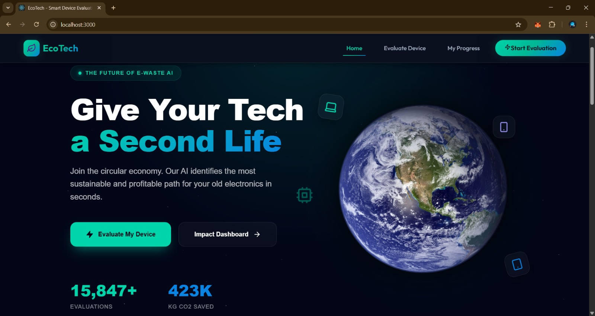</td>
    <td>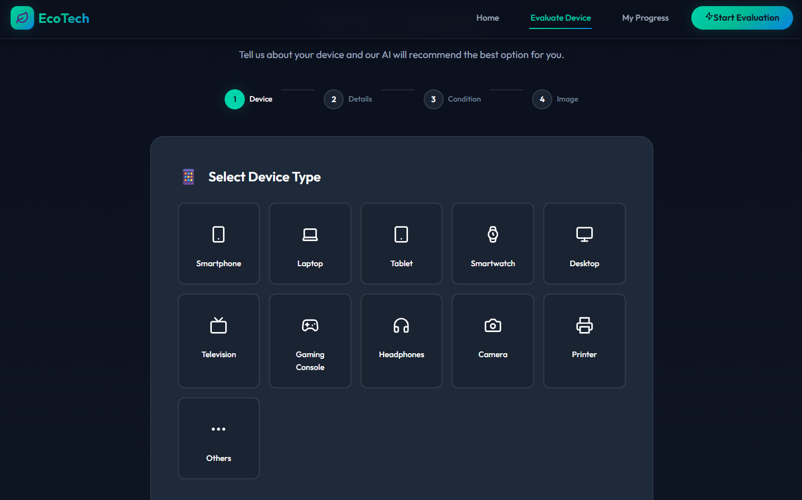</td>
    <td>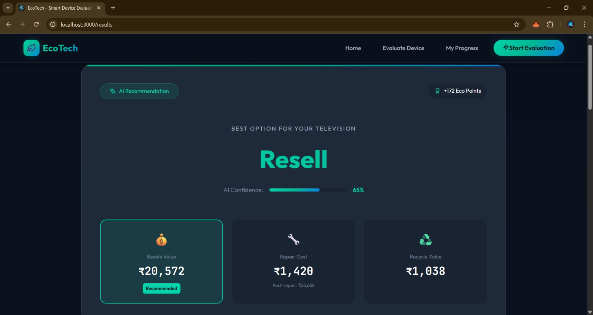</td>
    <td>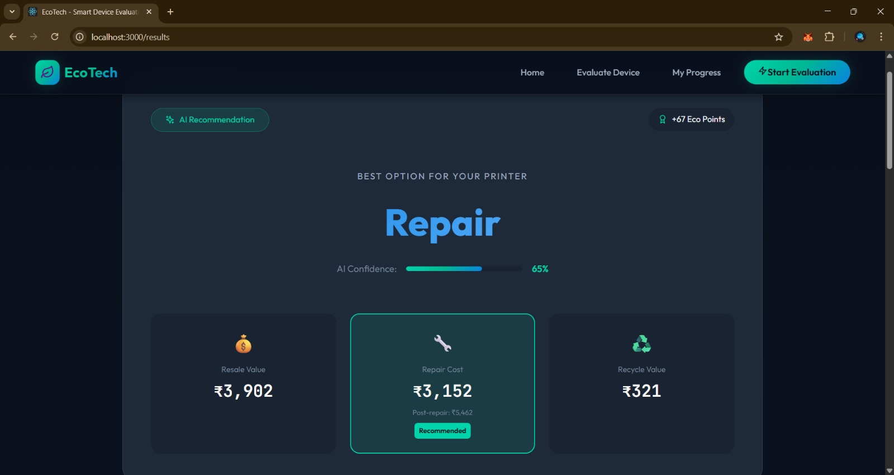</td>
  </tr>
  <tr>
    <td>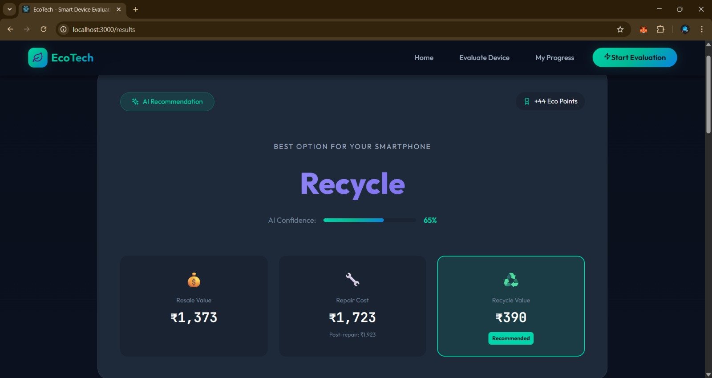</td>
    <td>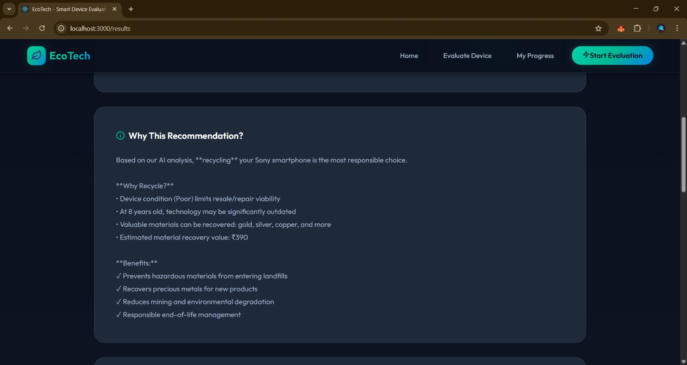</td>
    <td>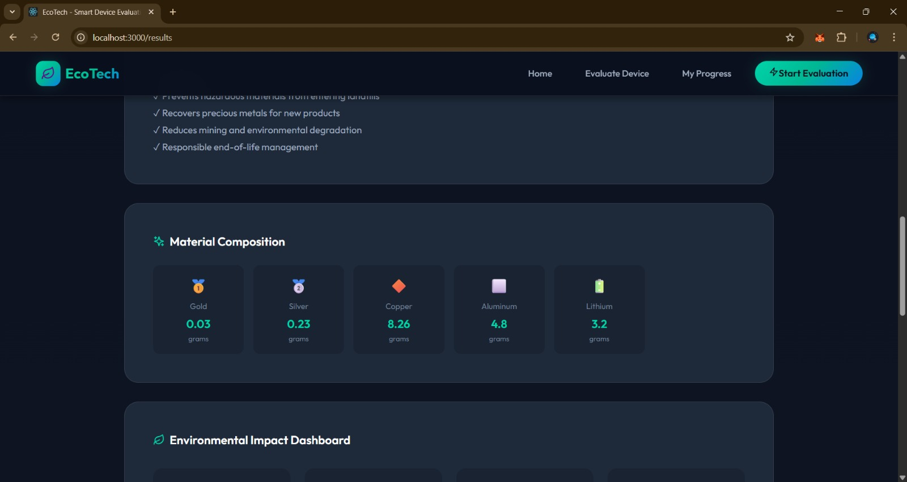</td>
    <td>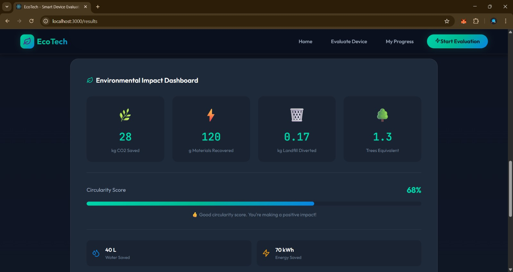</td>
  </tr>
  <tr>
    <td>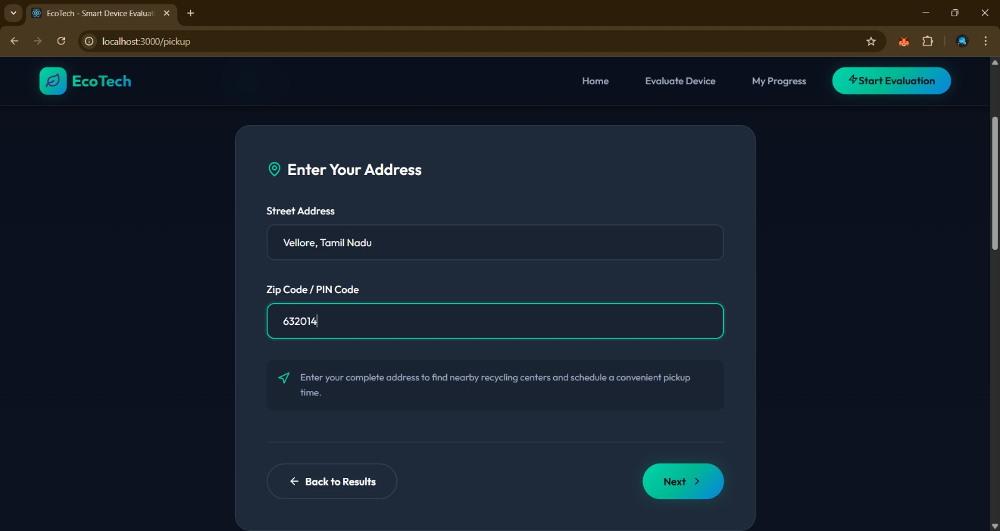</td>
    <td>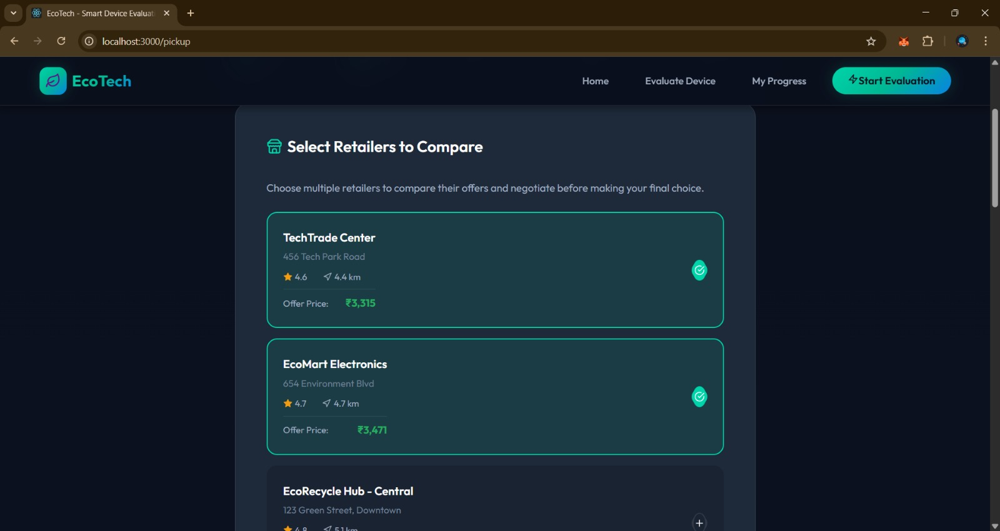</td>
    <td>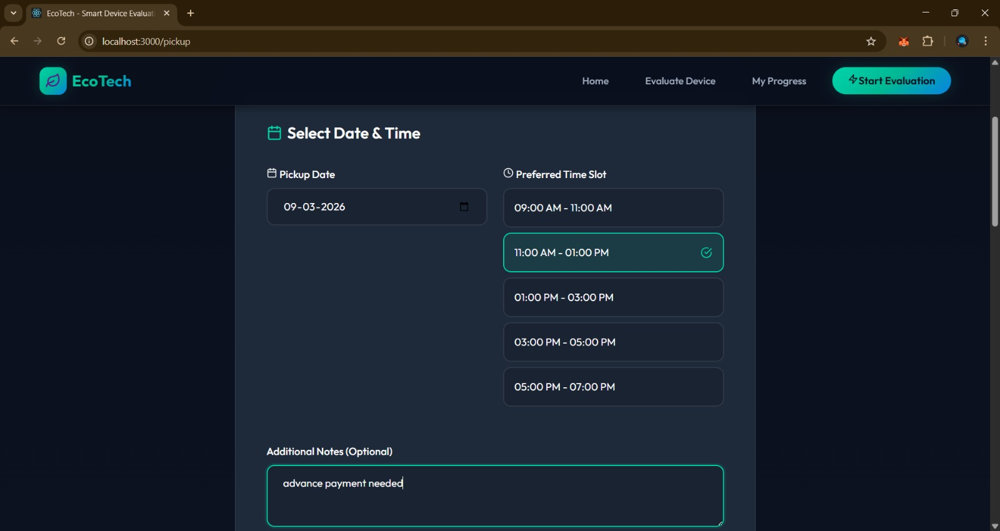</td>
    <td>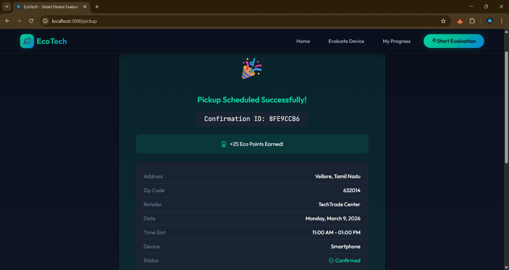</td>
  </tr>
  <tr>
    <td>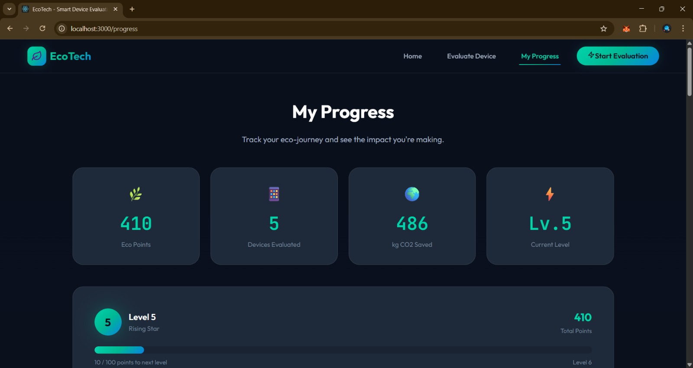</td>
    <td>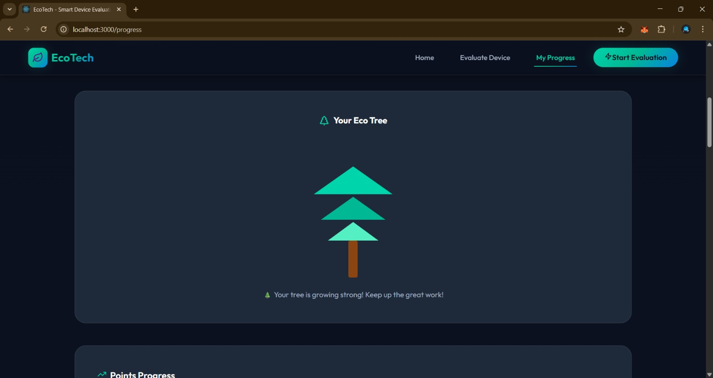</td>
    <td>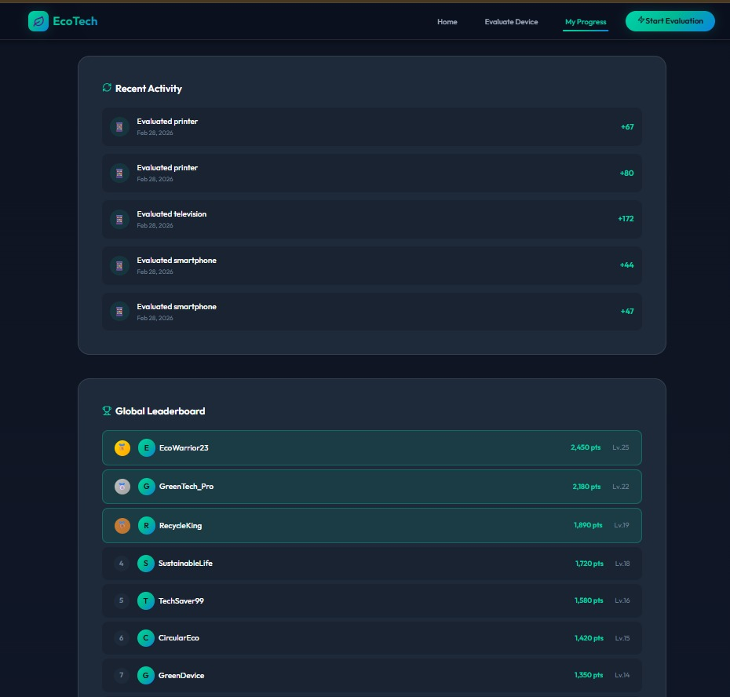</td>
    <td>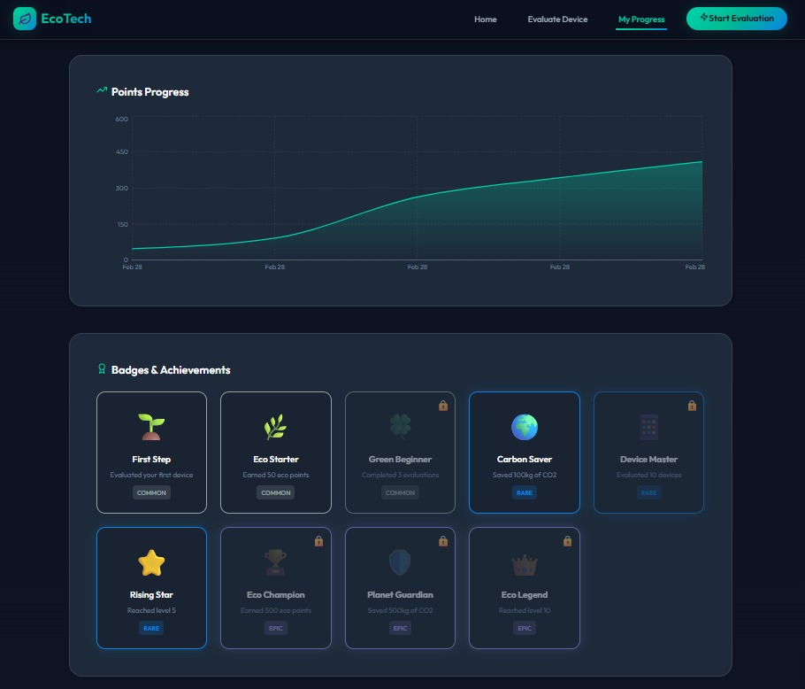</td>
  </tr>
  
  <tr>
  <td>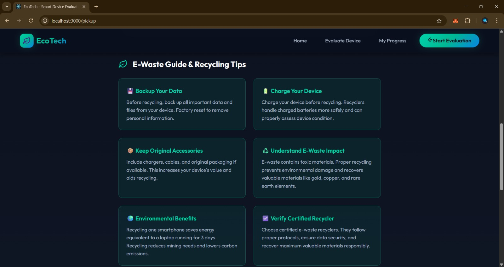</td>
  </tr>
</table>
